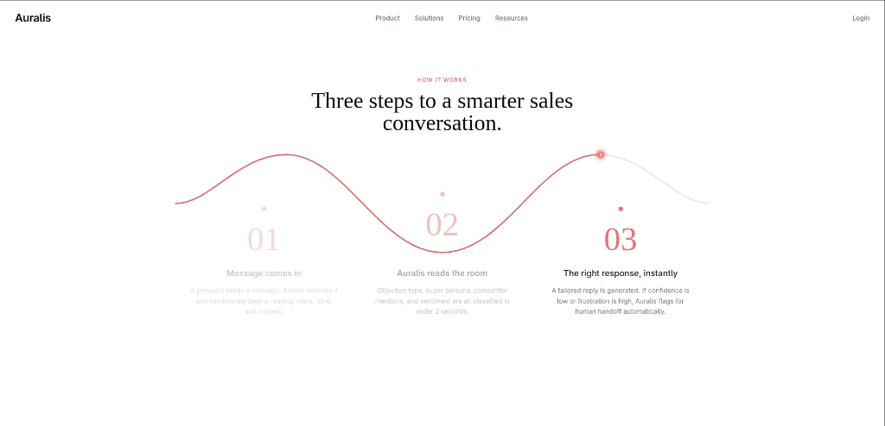
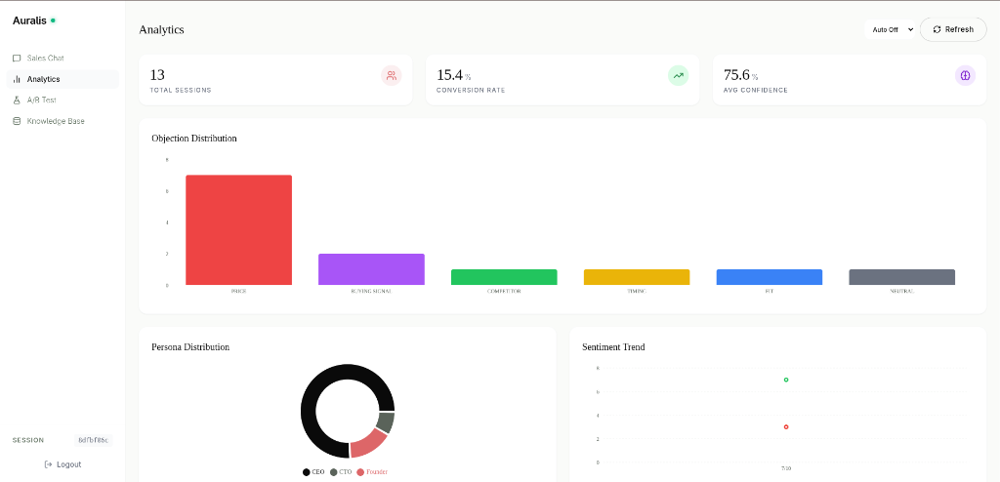
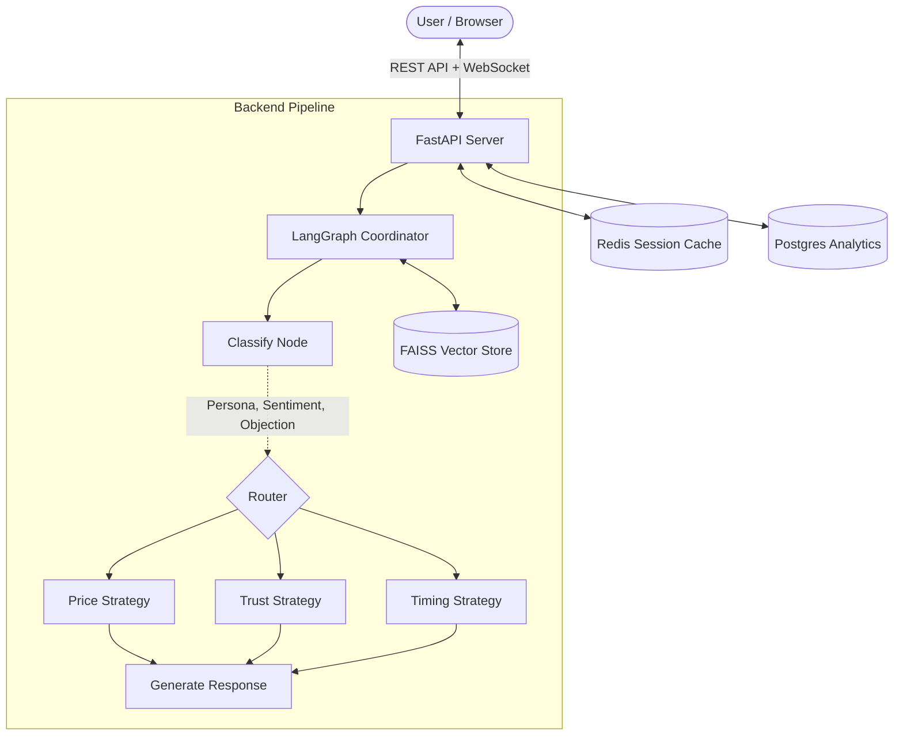

<div align="center">

```
 █████╗ ██╗   ██╗██████╗  █████╗ ██╗     ██╗███████╗
██╔══██╗██║   ██║██╔══██╗██╔══██╗██║     ██║██╔════╝
███████║██║   ██║██████╔╝███████║██║     ██║███████╗
██╔══██║██║   ██║██╔══██╗██╔══██║██║     ██║╚════██║
██║  ██║╚██████╔╝██║  ██║██║  ██║███████╗██║███████║
╚═╝  ╚═╝ ╚═════╝ ╚═╝  ╚═╝╚═╝  ╚═╝╚══════╝╚═╝╚══════╝
```

### 🎙️ The AI Sales Coach that reads the room.

<p align="center">
  <a href="https://auralis-client-five.vercel.app"><b>✨ View Live Demo</b></a> •
  <a href="#-architecture">Architecture</a> •
  <a href="#-features">Features</a> •
  <a href="#-screenshots">Screenshots</a> •
  <a href="#-quickstart">Quickstart</a> •
  <a href="#%EF%B8%8F-deployment">Deployment</a>
</p>

[](https://github.com/aayush2724/Auralis/actions/workflows/ci.yml)
[](https://vercel.com/new/clone?repository-url=https%3A%2F%2Fgithub.com%2Faayush2724%2FAuralis)
[](https://render.com/deploy?repo=https://github.com/aayush2724/Auralis)
[](https://www.python.org/)
[](https://fastapi.tiangolo.com/)
[](https://github.com/langchain-ai/langgraph)
[](https://react.dev/)
[](https://tailwindcss.com/)

</div>

<br/>

> **Auralis** is an adaptive sales intelligence platform that classifies objections with **94% confidence**, detects customer personas and sentiment in real-time, and generates role-specific responses in **under 2 seconds**. Built for high-performance sales teams using **LangGraph** multi-agent pipelines and **Retrieval-Augmented Generation (RAG)**.

---

## 📸 Screenshots

### How It Works — Landing Page

> Three intelligent steps that turn a raw prospect message into a precision-crafted, persona-aware reply.



<br/>

### Analytics Dashboard

> Real-time metrics on sessions, conversion rates, objection distribution, persona breakdowns, and sentiment trends — all in one view.



---

## ⚡ Live Demo

The application is fully deployed and ready to test. No sign-up friction — just click and explore.

| Layer | URL / Service |
|---|---|
| 🖥️ **Frontend** | [auralis-client-five.vercel.app](https://auralis-client-five.vercel.app) |
| ⚙️ **Backend API** | FastAPI on Render |
| 🗄️ **Database** | PostgreSQL on Neon |
| ⚡ **Cache** | Redis on Upstash |

---

## 🏗️ Architecture

Auralis uses a **decoupled microservices architecture** with a Directed Acyclic Graph (DAG) for conversational state management via LangGraph.

```
┌─────────────────────────────────────────────────────────────────┐
│                         CLIENT LAYER                            │
│                                                                 │
│   React 18 + TypeScript  ──►  Vite  ──►  Tailwind CSS          │
│   WebSocket Chat  ──►  REST API  ──►  JWT Auth                  │
└────────────────────────────┬────────────────────────────────────┘
                             │ HTTPS / WSS
┌────────────────────────────▼────────────────────────────────────┐
│                        API GATEWAY                              │
│                                                                 │
│              FastAPI  (Python 3.11+)                            │
│         REST endpoints  +  /ws/chat  WebSocket                  │
│              Prometheus metrics  /metrics                       │
└───────┬───────────────────────────────────┬─────────────────────┘
        │                                   │
┌───────▼──────────┐             ┌──────────▼──────────┐
│   Redis Cache    │             │  PostgreSQL (Neon)   │
│  Session state   │             │  Analytics events   │
│  A/B assignments │             │  Conversation logs  │
└──────────────────┘             └─────────────────────┘
        │
┌───────▼──────────────────────────────────────────────────────┐
│                    LANGGRAPH PIPELINE                         │
│                                                              │
│  ┌─────────────┐    ┌──────────────────────────────────┐    │
│  │  Classify   │──► │         Router (DAG)              │    │
│  │    Node     │    │  ┌──────────┬──────────┬────────┐│    │
│  │             │    │  │  Price   │  Trust   │ Timing ││    │
│  │ • Objection │    │  │ Strategy │ Strategy │Strategy││    │
│  │ • Persona   │    │  └────┬─────┴────┬─────┴───┬────┘│    │
│  │ • Sentiment │    │       └──────────▼──────────┘     │    │
│  └─────────────┘    │           Generate Node           │    │
│                     └──────────────────────────────────┘    │
│                                   │                          │
│  ┌────────────────────────────────▼─────────────────────┐   │
│  │           FAISS Vector Store (RAG)                    │   │
│  │   PDF + CSV + Markdown ingestion  ──►  Similarity     │   │
│  │   search  ──►  Source citations injected into reply   │   │
│  └───────────────────────────────────────────────────────┘   │
└──────────────────────────────────────────────────────────────┘
```



---

## ✨ 14 Production Features

Auralis isn't just a prototype — it ships **14 production-grade features** designed for real-world scaling and observability.

<details>
<summary><b>🧠 1. Core AI Capabilities (Click to expand)</b></summary>

| Feature | Description | Tech |
|---|---|---|
| **Objection Classification** | Automatically classifies client objections into: `pricing`, `timing`, `trust`, `fit`, `competitors` | LangGraph + Gemini |
| **Sentiment Analysis** | Real-time sentiment scoring to gauge customer frustration or enthusiasm on every message | Custom classifier |
| **Persona Profiling** | Detects buyer personas: `Assertive`, `Analytical`, `Amiable`, `Expressive` to tailor tone | Prompt engineering |
| **Adaptive Pipeline** | DAG routing via LangGraph selects the right strategy node dynamically per classification | LangGraph |

</details>

<details>
<summary><b>📚 2. Knowledge & RAG (Click to expand)</b></summary>

| Feature | Description | Tech |
|---|---|---|
| **Vector Retrieval** | High-performance similarity search over sales collateral | FAISS |
| **Multi-Format Ingestion** | Supports `PDF`, `CSV`, and `Markdown` file uploads to the knowledge base | LangChain loaders |
| **Source Citations** | Appends factual citations to every synthesized answer to prevent hallucinations | RAG pipeline |
| **Explainability Tracking** | Exposes per-node execution metadata showing *why* a strategy was selected | LangGraph metadata |

</details>

<details>
<summary><b>⚙️ 3. Systems & Infrastructure (Click to expand)</b></summary>

| Feature | Description | Tech |
|---|---|---|
| **Human Handoff** | Triggers immediate human escalation when confidence is low or frustration is detected | Threshold routing |
| **A/B Testing** | Deterministic 50/50 variant assignment (`Static` vs `Adaptive`) persisted per user | Redis |
| **Analytics Event Tracker** | Logs sentiment trends and variant conversion ratios for dashboard reporting | PostgreSQL |
| **Redis Session Cache** | Persists conversation history and state for sub-millisecond retrieval | Redis / Upstash |
| **JWT Authentication** | Secures REST and WebSocket chat channels with JSON Web Tokens | FastAPI + python-jose |
| **Real-time Chat Transport** | Authenticated WebSocket at `/ws/chat` with automatic HTTP fallback | Starlette WebSocket |
| **Prometheus Monitoring** | Structured latency and request metrics exposed at `/metrics` | prometheus-fastapi |

</details>

---

## 🚀 Quickstart (Local Development)

Spin up the **entire stack** — PostgreSQL, Redis, FastAPI, and React — in three commands using Docker Compose.

### Prerequisites

```
┌─────────────────────────────────────────────────────┐
│  Required tools                                     │
│  ─────────────────────────────────────────────────  │
│  ✓  Docker  ≥ 24.x   (with Compose plugin)         │
│  ✓  Git                                             │
│  ✓  A Gemini API Key  (or OpenAI API Key)           │
└─────────────────────────────────────────────────────┘
```

### Step-by-step

```bash
# ── Step 1: Clone the repository ─────────────────────────────────
git clone https://github.com/aayush2724/Auralis.git
cd Auralis

# ── Step 2: Configure environment variables ───────────────────────
cp .env.example .env
# Open .env and set the required keys:
#   GEMINI_API_KEY=your_key_here
#   JWT_SECRET_KEY=a_long_random_secret_at_least_32_chars

# ── Step 3: Start the full stack ─────────────────────────────────
docker compose up --build
```

Once the containers are healthy:

| Service | URL |
|---|---|
| 🖥️ React Frontend | `http://localhost:4000` |
| ⚙️ FastAPI Backend | `http://localhost:8001` |
| 📖 API Docs (Swagger) | `http://localhost:8001/docs` |
| 📊 Metrics | `http://localhost:8001/metrics` |

### Running Without Docker (Dev Mode)

<details>
<summary>Expand for manual setup instructions</summary>

**Backend**
```bash
cd server
python -m venv .venv
source .venv/bin/activate
pip install -r requirements.txt

# Start FastAPI dev server
uvicorn src.main:app --reload --port 8001
```

**Frontend**
```bash
cd client
npm install
npm run dev
# Vite proxies /api → localhost:8001 automatically
```

</details>

---

## ⚙️ Environment Variables

All configuration lives in `.env`. Copy from `.env.example` as your starting point.

```bash
cp .env.example .env
```

| Variable | Required | Description |
|---|---|---|
| `GEMINI_API_KEY` | ✅ | Google Gemini API key for LLM inference |
| `OPENAI_API_KEY` | ⬜ | Optional fallback — set `LLM_MODEL=gpt-4o` |
| `JWT_SECRET_KEY` | ✅ | Random secret ≥ 32 chars for token signing |
| `DATABASE_URL` | ✅ | PostgreSQL connection string (asyncpg format) |
| `REDIS_URL` | ✅ | Redis connection string |
| `VECTORSTORE_PATH` | ✅ | Filesystem path for FAISS index |
| `EMBEDDING_MODEL` | ✅ | Sentence-transformers model name |
| `LLM_MODEL` | ✅ | `gemini-pro` or `gpt-4o` |
| `LLM_TEMPERATURE` | ⬜ | Default `0.2` — lower = more deterministic |
| `ADMIN_EMAIL` | ⬜ | Seeded admin account email |
| `ADMIN_PASSWORD` | ⬜ | Seeded admin account password |
| `VITE_API_URL` | ✅ | Frontend API base URL (`/api` in dev) |

---

## 🗂️ Project Structure

```
Auralis/
├── client/                     # React 18 + TypeScript frontend
│   ├── src/
│   │   ├── components/         # Reusable UI components
│   │   ├── pages/              # Route-level page components
│   │   └── ...
│   ├── public/
│   │   └── screenshots/        # App screenshots (used in docs)
│   ├── vite.config.ts
│   └── vercel.json             # SPA routing config for Vercel
│
├── server/                     # FastAPI Python backend
│   ├── src/
│   │   ├── main.py             # App entrypoint
│   │   ├── routers/            # API route handlers
│   │   ├── agents/             # LangGraph pipeline nodes
│   │   ├── models/             # SQLAlchemy DB models
│   │   └── ...
│   ├── requirements.txt
│   └── tests/                  # Pytest test suite
│
├── vectorstore/                # FAISS index files (git-ignored)
├── data/                       # Knowledge base upload directory
│
├── docker-compose.yml          # Full-stack Docker orchestration
├── Dockerfile                  # Backend container
├── Dockerfile.frontend         # Frontend container
├── render.yaml                 # One-click Render deployment
├── Makefile                    # Dev shortcuts
└── .env.example                # Environment variable template
```

---

## ☁️ Deployment

This repository is **cloud-deployment ready** out of the box.

### Frontend → Vercel

```bash
# One-click deploy
# Click the "Deploy with Vercel" button at the top of this README
# or connect your fork manually in the Vercel dashboard.
```

`client/vercel.json` handles SPA routing automatically — no extra config needed.

### Backend → Render

```bash
# Click the "Deploy to Render" button at the top of this README.
# render.yaml provisions:
#   - FastAPI Web Service
#   - Redis Cache (Upstash)
```

The `render.yaml` blueprint auto-configures both services. Point `VITE_API_URL` to your Render backend URL as a Vercel environment variable.

### CI/CD

GitHub Actions runs the full test suite on every push and pull request:

```
.github/
└── workflows/
    └── ci.yml    # Lint → Test → Build
```

---

## 🧪 Testing

```bash
# Run the full test suite
cd server
pytest tests/ -v

# With coverage report
pytest tests/ --cov=src --cov-report=term-missing
```

The test suite covers the classification pipeline, RAG retrieval, API endpoints, and JWT authentication flows.

---

## 🗺️ Roadmap

```
 [✅] Core classification pipeline (objection + persona + sentiment)
 [✅] LangGraph multi-strategy routing
 [✅] RAG with FAISS + multi-format ingestion
 [✅] JWT-secured REST + WebSocket APIs
 [✅] Redis session persistence
 [✅] A/B testing framework
 [✅] PostgreSQL analytics & event logging
 [✅] Prometheus observability
 [✅] Docker Compose full-stack orchestration
 [✅] CI/CD via GitHub Actions
 [⬜] Voice input / STT integration
 [⬜] Slack / CRM webhook integrations
 [⬜] Multi-tenant workspace support
 [⬜] Fine-tuned classification model
```

---

## 📄 Resume / Portfolio Summary

> *Built Auralis, an adaptive sales intelligence platform using LangGraph + RAG with end-to-end production architecture: React frontend, FastAPI backend, JWT-secured REST + WebSocket APIs, PostgreSQL persistence, Redis-backed A/B experiments, CI/CD, and Prometheus observability.*

---

## 📜 License

This project is open source. Feel free to fork, star ⭐, and build on it.

---

<div align="center">

```
made with ♥ by aayush
```

**[⬆ Back to top](#auralis-️)**

</div>
